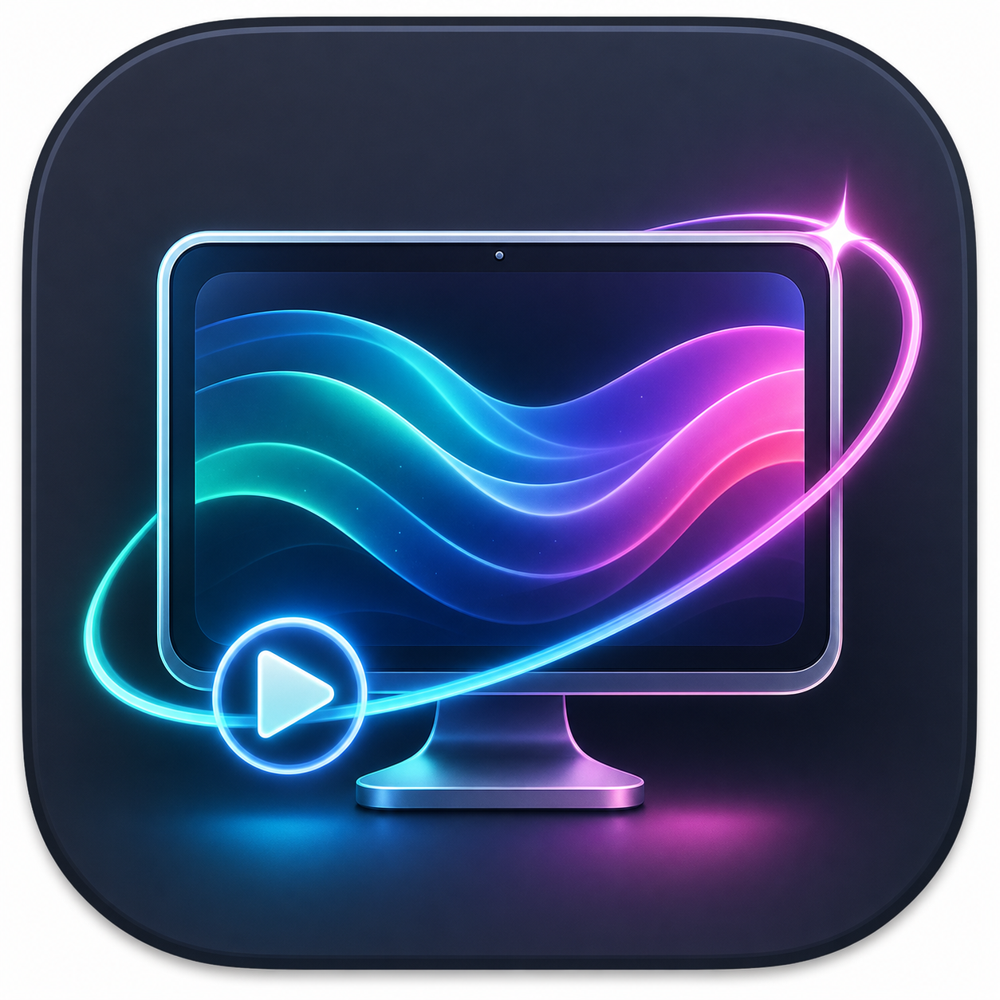
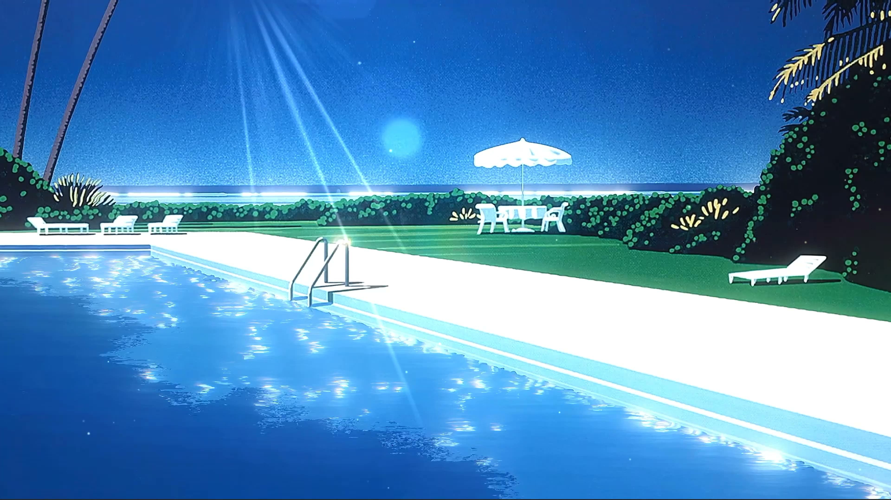
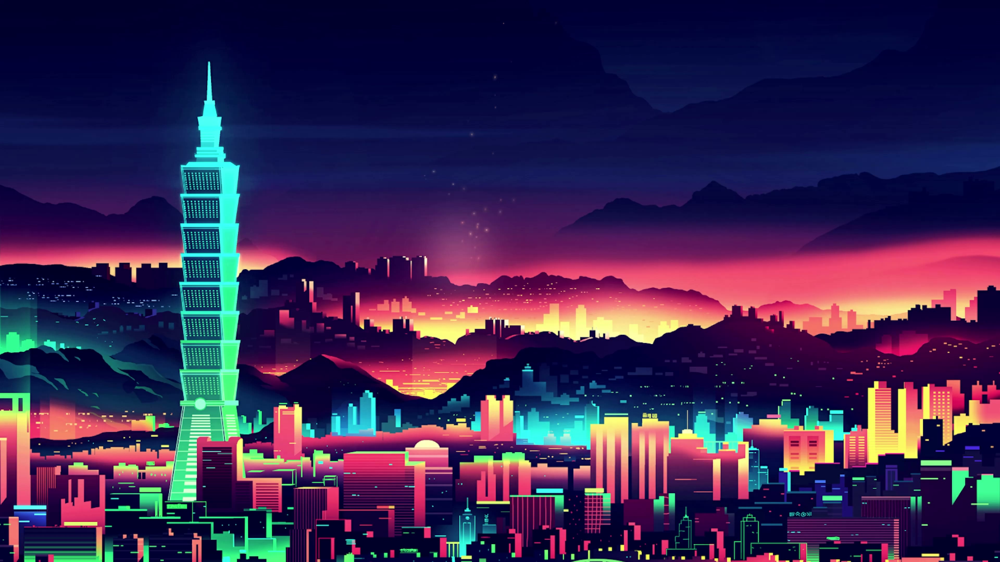
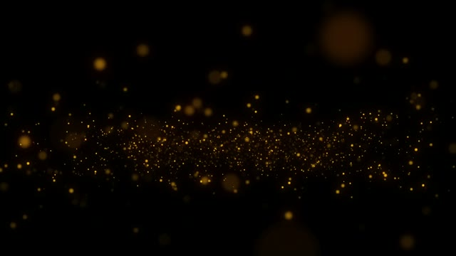
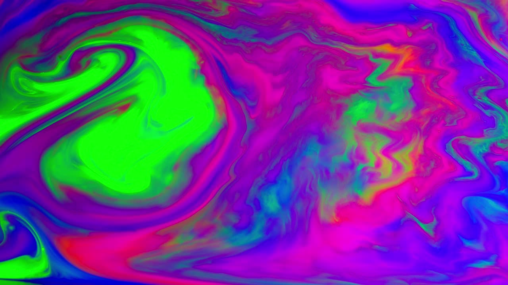

<div align="center">



# WallpaperEngineMac

**내가 가진 Wallpaper Engine 스타일 동영상 배경화면을 macOS에서 재생하는 메뉴바 앱.**


[English](README.md) · **한국어**

</div>

<p align="center">
  
</p>

> 이미 가지고 있는 영상 배경화면을 데스크톱 아이콘 뒤에서 틀어 줍니다. 하드웨어 디코딩으로 가볍게 돌아가고, 배터리를 아끼며, 소리는 기본적으로 꺼져 있습니다.

---

## ✨ 한눈에 보기

- **Wallpaper Engine 폴더를 그대로 가져오기** — `Steam/steamapps/workshop/content/431960/` 같은 워크샵 폴더는 물론, `project.json`이 든 배경화면 폴더, `project.json` 파일 하나, 또는 `.mp4` / `.m4v` / `.mov` 영상 파일을 바로 불러올 수 있습니다.
- **가벼운 라이브러리 창** — `project.json`을 읽어 제목·종류를 정리하고, 미리보기 썸네일과 함께 재생 가능 여부까지 한눈에 보여 줍니다.
- **아이콘 뒤에서 재생** — 연결된 모든 디스플레이에서 `AVQueuePlayer` + `AVPlayerLooper`로 끊김 없이 반복 재생합니다. 디코딩은 VideoToolbox가 하드웨어로 처리합니다.
- **라이트/다크 자동 전환** — 밝을 때와 어두울 때 쓸 배경화면을 따로 정해 두면, macOS 외관 모드나 시간대(주간/야간)에 맞춰 알아서 바꿔 줍니다.
- **인터랙티브 이미지 오브젝트** — 배경화면 위에 앨범 커버나 원하는 이미지를 얹고, 편집 모드에서 클릭하거나 드래그해 위치를 맞출 수 있습니다.
- **배터리를 먼저 생각하는 절전** — 화면이 잠기거나, 디스플레이가 꺼지거나, 저전력 모드일 때, 배터리로 돌아갈 때(선택), 직접 멈췄을 때, 다른 창에 완전히 가려졌을 때 재생을 자동으로 멈춥니다.
- **오래 멈추면 디코더까지 정리** — 일정 시간 정지 상태가 이어지면 디코더 자원을 풀어 메모리를 돌려주고, 다시 켜질 때 재생을 새로 띄웁니다.
- **기본 음소거** — 필요하면 클릭 한 번으로 켜고 끌 수 있습니다.
- `Resources/`에 만들어 둔 `AppIcon.icns` 포함.

---

## 🌗 라이트 / 다크 자동 전환

한 쌍만 정해 두면 시스템 외관 모드나 시간대를 따라 알아서 바뀝니다.

<table>
  <tr>
    <th align="center">☀️ 라이트 / 주간</th>
    <th align="center">🌙 다크 / 야간</th>
  </tr>
  <tr>
    <td></td>
    <td></td>
  </tr>
  <tr>
    <td align="center"><code>city-pop-a-long-vacation-upscaled-4k</code></td>
    <td align="center"><code>city-pop-dark-4k-aesthetic-city-night</code></td>
  </tr>
</table>

메뉴바 앱에서 **`Automation`** 메뉴를 열고:

- 지금 적용된 배경화면을 **`Set Current as Light/Day`** 또는 **`Set Current as Dark/Night`**로 지정합니다(라이브러리 창의 버튼으로도 가능).
- **`Follow System Appearance`** — macOS 라이트/다크 모드를 그대로 따라갑니다.
- **`Follow Day/Night Schedule`** — 06:00과 18:00을 기준으로 주간·야간을 바꿉니다.

---

## 🧩 인터랙티브 오브젝트

메뉴바 앱의 **`Interactive Objects`** 메뉴에서 현재 배경화면 위에 미디어 오브젝트를 올릴 수 있습니다.

- **`Add Image Object to Current Wallpaper...`** — 선택한 이미지를 현재 프로젝트 폴더로 복사하고 `project.json`에 오브젝트를 추가합니다.
- **`Add Video Object to Current Wallpaper...`** — 음소거된 반복 재생 `.mp4`, `.m4v`, `.mov` 오브젝트를 배경화면 위에 추가합니다.
- **`Add Live2D Web Object...`** — 로컬 Live2D/Cubism Web HTML 진입 파일이 들어 있는 폴더를 복사하고, WebKit 오브젝트로 렌더링합니다. Live2D 런타임은 앱에 포함하지 않으니 사용 권한이 있는 에셋을 넣어야 합니다.
- **`Edit / Interact With Objects`** — 배경화면을 편집 레이어로 올려 오브젝트를 클릭하고 드래그할 수 있게 합니다. 끄면 다시 데스크톱 아이콘 뒤로 돌아갑니다.
- **`Remove Object`** — `project.json`에서 오브젝트를 제거하고, 앱이 `InteractiveObjects/` 아래에 복사한 에셋이면 파일도 함께 삭제합니다.
- **`Reset Object Positions`** — 현재 배경화면에서 저장된 드래그 위치를 초기화합니다.

프로젝트에서 직접 정의할 수도 있습니다.

```json
{
  "interactive": {
    "objects": [
      {
        "id": "album-cover",
        "type": "albumArt",
        "title": "Album Cover",
        "file": "InteractiveObjects/cover.jpg",
        "frame": { "x": 0.68, "y": 0.24, "width": 0.18, "height": 0.18 },
        "cornerRadius": 12,
        "draggable": true
      }
    ]
  }
}
```

`frame` 값은 화면 비율 기준입니다. `x`와 `y`는 좌상단에서 시작하고, `width`와 `height`는 디스플레이 크기에 대한 비율입니다.

---

## 🧰 Steam Workshop 보조 기능

앱은 Steam을 우회하거나 창작마당 파일을 재배포하지 않습니다. **`Steam Workshop`** 메뉴는 공식 Steam 경로 주변의 보조 기능만 제공합니다.

- **`Open Wallpaper Engine Workshop`** — Wallpaper Engine의 공개 창작마당 페이지를 엽니다.
- **`Open Workshop Item...`** — Workshop URL이나 published file ID를 받아 Steam을 통해 해당 아이템 페이지를 엽니다.
- **`Import Local Workshop Folder`** — Steam이 이미 설치해 둔 `steamapps/workshop/content/431960` 폴더를 가져옵니다.
- **`Download Item with SteamCMD...`** — 익명 SteamCMD 다운로드를 앱 지원 폴더에 시도하고, Steam이 허용하면 해당 아이템을 가져옵니다.

일부 창작마당 아이템은 Wallpaper Engine 소유나 Steam 로그인이 필요하므로 SteamCMD 다운로드가 정상적으로 실패할 수 있습니다.

---

## 🖼️ 함께 들어 있는 샘플 배경화면

바로 테스트해 볼 수 있도록 Wallpaper Engine 형식의 동영상 프로젝트로 만들어 두었습니다. 폴더째 가져오면 됩니다.

<table>
  <tr>
    <td width="50%"></td>
    <td width="50%"></td>
  </tr>
  <tr>
    <td align="center"><b>Ambient Test Loop</b><br/><code>SampleWallpapers/ambient-test-loop</code><br/><sub>4K · 10초 · 30 fps</sub></td>
    <td align="center"><b>Abstract Macro Fluid</b><br/><code>SampleWallpapers/mixkit-abstract-macro-fluid-background</code><br/><sub>1080p · 약 13초</sub></td>
  </tr>
  <tr>
    <td width="50%"></td>
    <td width="50%"></td>
  </tr>
  <tr>
    <td align="center"><b>City Pop — A Long Vacation</b> ☀️<br/><code>city-pop-a-long-vacation-upscaled-4k</code><br/><sub>4K 업스케일 · 60 fps</sub></td>
    <td align="center"><b>Aesthetic City at Night</b> 🌙<br/><code>city-pop-dark-4k-aesthetic-city-night</code><br/><sub>4K · 30 fps</sub></td>
  </tr>
</table>

---

## 🚀 실행

```sh
swift run WallpaperEngineMac
```

실행하면 메뉴바에 앱이 뜹니다. **`Import Folder or Video`**로 로컬 파일을 추가한 다음, 메뉴나 라이브러리 창에서 원하는 영상 배경화면을 적용하세요.

## 🧪 테스트

```sh
swift run WallpaperEngineSmokeTests
```

---

## 📦 프로젝트 구조

```
WallpaperEngineMac/
├── Sources/
│   ├── WallpaperEngineCore/   # project.json 파싱, 라이브러리 스캔
│   ├── WallpaperEngineMac/    # 메뉴바 앱, 렌더러, 전력 관리
│   └── WallpaperEngineSmokeTests/
├── SampleWallpapers/          # 가져올 수 있는 샘플 동영상 프로젝트
├── Resources/                 # 앱 아이콘
└── Scripts/build-app.sh       # .app 번들 생성
```

---

## 🎬 출처 & 라이선스

샘플 폴더마다 자세한 출처를 담은 `SOURCE.md`가 들어 있습니다. 요약하면 다음과 같습니다.

| 샘플 | 출처 | 라이선스 / 비고 |
| --- | --- | --- |
| Ambient Test Loop | Pixabay 4K 앰비언트 루프 | 로컬 테스트용 |
| Abstract Macro Fluid | [Mixkit](https://mixkit.co/free-stock-video/abstract-macro-fluid-background-101740/) | [Mixkit Free License](https://mixkit.co/license/#videoFree) |
| City Pop — A Long Vacation | [DesktopHut](https://www.desktophut.com/City-Pop-A-Long-Vacation-Live-Wallpaper) | 개인 로컬 사용 · 업스케일본 |
| Aesthetic City at Night | [MotionBgs](https://motionbgs.com/aesthetic-city-at-the-night) | 권리는 원저작자에게 있음 |

이 앱은 Wallpaper Engine 워크샵 콘텐츠를 **내려받거나 재배포하지 않습니다.** 사용자가 이미 정당하게 확보해 로컬로 가져온 파일만 재생합니다. 함께 넣어 둔 샘플 배경화면은 로컬 테스트용이며, 다시 사용하기 전에 각 출처의 약관을 꼭 확인하세요.
